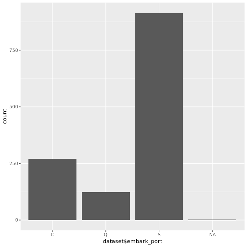
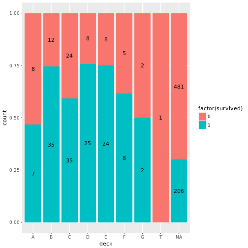
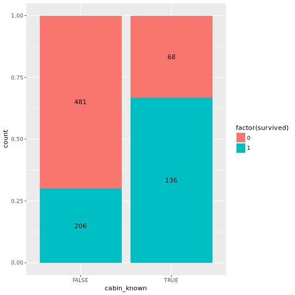
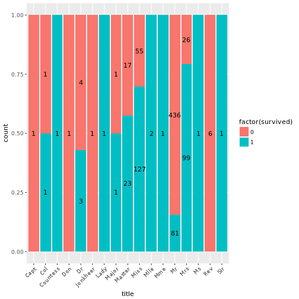
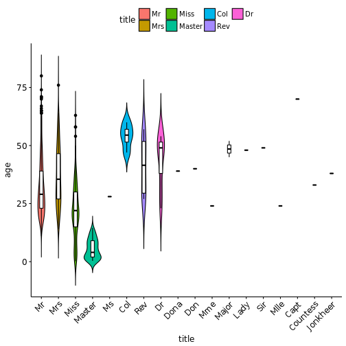
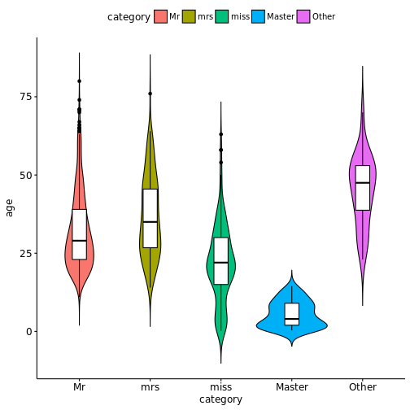
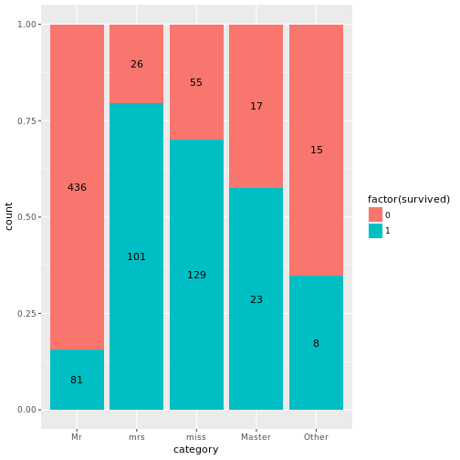

# Setup

# Introduction

# Load and check data


The references for each of them can be found in the bibliography at the end. 


```r
# Load all the project packages
library("knitr")
library("kableExtra")
library("bibtex")
library("tidyverse")
library("forcats")
library("lubridate")
library("stringr")
library("ggpubr")
library("ggmosaic")
library("broom")
library("caret")
library("ranger")
library("gbm")
library("parallel")
library("GGally")
library("doParallel")
```


Once the libraries are loaded it's time for reading the data.

I put everything in a single dataframe and add a `set` column to distinguish
the training from the testing data.


```r
dataset <- 
  read_csv("data/train.csv") %>%
  mutate(set = "train")

dataset <- 
  read_csv("data/test.csv") %>%
  mutate(set = "test",
         Survived = NA) %>%
  bind_rows(dataset)
```

Then we take a glimpse at the data.


```r
glimpse(dataset)
```

```
## Observations: 1,309
## Variables: 13
## $ PassengerId <int> 892, 893, 894, 895, 896, 897, 898, 899, 900, 901, ...
## $ Pclass      <int> 3, 3, 2, 3, 3, 3, 3, 2, 3, 3, 3, 1, 1, 2, 1, 2, 2,...
## $ Name        <chr> "Kelly, Mr. James", "Wilkes, Mrs. James (Ellen Nee...
## $ Sex         <chr> "male", "female", "male", "male", "female", "male"...
## $ Age         <dbl> 34.5, 47.0, 62.0, 27.0, 22.0, 14.0, 30.0, 26.0, 18...
## $ SibSp       <int> 0, 1, 0, 0, 1, 0, 0, 1, 0, 2, 0, 0, 1, 1, 1, 1, 0,...
## $ Parch       <int> 0, 0, 0, 0, 1, 0, 0, 1, 0, 0, 0, 0, 0, 0, 0, 0, 0,...
## $ Ticket      <chr> "330911", "363272", "240276", "315154", "3101298",...
## $ Fare        <dbl> 7.8292, 7.0000, 9.6875, 8.6625, 12.2875, 9.2250, 7...
## $ Cabin       <chr> NA, NA, NA, NA, NA, NA, NA, NA, NA, NA, NA, NA, "B...
## $ Embarked    <chr> "Q", "S", "Q", "S", "S", "S", "Q", "S", "C", "S", ...
## $ set         <chr> "test", "test", "test", "test", "test", "test", "t...
## $ Survived    <int> NA, NA, NA, NA, NA, NA, NA, NA, NA, NA, NA, NA, NA...
```

There is 12 variables plus the "set" variable I added.
And 1,309 observations.

Now I reorder and rename the columns following these rules:  

* snake_case
* somewhat logical names


```r
dataset <- dataset %>%
  select(passenger_id    = PassengerId, # passenger identifier in the dataset
         name            = Name,        # name of the passenger
         sex             = Sex,         # sexe
         age             = Age,         # age
         family_horiz    = SibSp,       # number of family members on the same level (siblings or spouse)
         family_vert     = Parch,       # number of family members a level away (children or parents)
         cabin_number    = Cabin,       # cabin number
         ticket_number   = Ticket,      # ticket number 
         ticket_class    = Pclass,      # is the ticket 1st, 2nd or 3rd class
         ticket_fare     = Fare,        # price of the ticket  
         embark_port     = Embarked,    # embarkment port
         survived        = Survived,    # survival - output targer
         set)                         # is the data from training or test

glimpse(dataset) # glimpse again to see the changes
```

```
## Observations: 1,309
## Variables: 13
## $ passenger_id  <int> 892, 893, 894, 895, 896, 897, 898, 899, 900, 901...
## $ name          <chr> "Kelly, Mr. James", "Wilkes, Mrs. James (Ellen N...
## $ sex           <chr> "male", "female", "male", "male", "female", "mal...
## $ age           <dbl> 34.5, 47.0, 62.0, 27.0, 22.0, 14.0, 30.0, 26.0, ...
## $ family_horiz  <int> 0, 1, 0, 0, 1, 0, 0, 1, 0, 2, 0, 0, 1, 1, 1, 1, ...
## $ family_vert   <int> 0, 0, 0, 0, 1, 0, 0, 1, 0, 0, 0, 0, 0, 0, 0, 0, ...
## $ cabin_number  <chr> NA, NA, NA, NA, NA, NA, NA, NA, NA, NA, NA, NA, ...
## $ ticket_number <chr> "330911", "363272", "240276", "315154", "3101298...
## $ ticket_class  <int> 3, 3, 2, 3, 3, 3, 3, 2, 3, 3, 3, 1, 1, 2, 1, 2, ...
## $ ticket_fare   <dbl> 7.8292, 7.0000, 9.6875, 8.6625, 12.2875, 9.2250,...
## $ embark_port   <chr> "Q", "S", "Q", "S", "S", "S", "Q", "S", "C", "S"...
## $ survived      <int> NA, NA, NA, NA, NA, NA, NA, NA, NA, NA, NA, NA, ...
## $ set           <chr> "test", "test", "test", "test", "test", "test", ...
```

The variables `name`, `sexe`, `cabin_number`, `ticket_number` and `embark_port`
are strings and will need to be transformed correctly if we want to use
them for prediction.

# Missing data and feature engineering

Dealing with missing values is crucial. I begin by simply counting the number
of missing values for each variable.


```r
map_df(dataset, function(x) {sum(is.na(x))}) %>% 
  gather(variable, missing) %>%
  arrange(desc(missing))
```

```
## # A tibble: 13 x 2
##         variable missing
##            <chr>   <int>
##  1  cabin_number    1014
##  2      survived     418
##  3           age     263
##  4   embark_port       2
##  5   ticket_fare       1
##  6  passenger_id       0
##  7          name       0
##  8           sex       0
##  9  family_horiz       0
## 10   family_vert       0
## 11 ticket_number       0
## 12  ticket_class       0
## 13           set       0
```

## Ticket fare

Because there is only one missing value for the `ticket_fare` we can explore it
directly.


```r
dataset %>%
  filter(is.na(ticket_fare))
```

```
## # A tibble: 1 x 13
##   passenger_id               name   sex   age family_horiz family_vert
##          <int>              <chr> <chr> <dbl>        <int>       <int>
## 1         1044 Storey, Mr. Thomas  male  60.5            0           0
## # ... with 7 more variables: cabin_number <chr>, ticket_number <chr>,
## #   ticket_class <int>, ticket_fare <dbl>, embark_port <chr>,
## #   survived <int>, set <chr>
```

This passenger is not accompanied by family so price is probably for him alone. 
We can presume that the ticket fare is correlated with the ticket class. 
I will impute as it's `ticket_fare` the median of price for passenger in
class 3. If there were more missing values this simple imputation would not be
sufficient because of the several factors that can influence this variable. For
exemple the family size.


```r
dataset$ticket_fare[153] <- dataset %>%
  filter(ticket_class == 3) %>% 
  pull(ticket_fare) %>%
  median(na.rm = TRUE)
```

## Embarkment port

There is two missing values for the embarkment port. 


```r
# look at the variable
qplot(dataset$embark_port)
```



```r
# replace with S
dataset <- dataset %>%
  replace_na(list(embark_port = 'S'))
```

As the mode of this variable is Southampton by far we just replace the NAs with
`S`

## Cabin number

Only 295 passenger have a known `cabin_number`. Before dropping 
that variable let's see if we can extract some information from it.

First I will extract the deck.

Warnings :  

* Some passengers have several cabin number but all on the same deck 
* Some cabin numbers begin with "F" then a regular number but it seems it 
  correspond to cabin on the F deck

So for my purpose I will extract the first chararcter of the 'cabin_number'


```r
dataset <- dataset %>%
  mutate(deck = str_sub(cabin_number, 1, 1))

dataset %>%
  filter(set == "train") %>%
  ggplot(aes(x = deck, fill = factor(survived), label = ..count..)) +
    geom_bar(stat = "count", position = "fill") +
    geom_text(stat = "count", position = position_fill(vjust = 0.5))
```



It seems that the knowing the cabin's number is itself a factor of survival.
I will just keep a binary variable `cabin_known` then. I leave the `deck` 
variable there for know. Maybe we'll use it later.


```r
dataset <- dataset %>%
  mutate(cabin_known = !is.na(cabin_number))

dataset %>%
  filter(set == "train") %>%
  ggplot(aes(x = cabin_known, fill = factor(survived), label = ..count..)) +
    geom_bar(stat = "count", position = "fill") +
    geom_text(stat = "count", position = position_fill(vjust = 0.5))
```



## Titles and surname

There is a lot of missing data in the `age` and I don't think I have enough 
information yet to do some proper imputation so we will tackle the names first.

The name variable contains a lot of information :

* last name
* title
* first name (often the husband one if maried) 
* maiden name between parenthesis (the distinction between first name and 
  maiden family name is not obvious)
* surname between double quotes
* surname between parenthesis and double quotes (it seems to correspond to more 
  wealthy people)
  
Because of the wide variety of information let's just keep those :

* last name
* title
* presence of a surname 
* presence of a "formal" surname


```r
dataset <- dataset %>%
  mutate(last_name    = str_extract(name, "^.+,") %>%
                        str_extract("[A-Z][A-Z 'a-z]*"),
         title        = str_extract(name, ", .+[.]") %>%
                        str_extract("[A-Z][A-Z 'a-z]*"),
         surname      = ifelse(!is.na(str_extract(name, "\\(\".*\"\\)")),
                               "formal",
                               ifelse(!is.na(str_extract(name, "\".*\"")),
                                      "informal",
                                      NA)))

dataset %>%
  filter(set == "train") %>%
  ggplot(aes(x = title, fill = factor(survived), label = ..count..)) +
    geom_bar(stat = "count", position = "fill") +
    geom_text(stat = "count", position = position_fill(vjust = 0.5)) +
    theme(axis.text.x = element_text(angle = 45, hjust = 1))
```



We can see that there is a large number of different titles. They can represent
several things :

* the mark of nobility : sir, don, jonkheer...
* the type of profession : dr, reverend, capt, col...
* the age : master and miss for the children, Mr and Mrs for the adults
* the sexe : sir, lady, etc...

I want to remove the information we already have on other variables. So I will
normalise the titles. 

Because there is only a few occurence of the special titles I will create
a new variable *category* with *mr*, *mrs*, *miss*, *master* and *other* as
levels.

I will use a violin plot to confirm what title correspond to what age.


```r
ggviolin(data = dataset, x = "title", y = "age", fill = "title",
         add = "boxplot", add.params = list(fill = "white")) +
         theme(axis.text.x = element_text(angle = 45, hjust = 1))
```

```
## Warning: Removed 263 rows containing non-finite values (stat_ydensity).
```

```
## Warning: Removed 263 rows containing non-finite values (stat_boxplot).
```



```r
dataset <- dataset %>% 
  mutate(category = as_factor(title) %>%
         # we add the foreign and variant to there group
           fct_collapse(mrs = c("Mrs", "Mme", "Ms"),
                        miss = c("Miss", "Mlle")) %>%
         # we keep only the four more frequent group and lump the rest together
           fct_lump(n = 4)) 

# we take a look again at the ages
ggviolin(data = dataset, x = "category", y = "age", fill = "category",
         add = "boxplot", add.params = list(fill = "white"))
```

```
## Warning: Removed 263 rows containing non-finite values (stat_ydensity).

## Warning: Removed 263 rows containing non-finite values (stat_boxplot).
```



```r
# and another look at the survival by category
dataset %>%
  filter(set == "train") %>%
  ggplot(aes(x = category, fill = factor(survived), label = ..count..)) +
    geom_bar(stat = "count", position = "fill") +
    geom_text(stat = "count", position = position_fill(vjust = 0.5))
```



## Age


<!-- biliography -->

---
nocite: |
  @base, @bibtex, @bindrcpp, @broom, @caret, @doParallel, @dplyr, @forcats, @foreach, @gbm, @GGally, @ggmosaic, @ggplot2, @ggpubr, @iterators, @kableExtra, @knitr, @lattice, @lubridate, @magrittr, @nvimcom, @parallel, @productplots, @purrr, @ranger, @readr, @rmarkdown, @splines, @stringr, @survival, @tibble, @tidyr, @tidyverse
...


# References and R packages used
